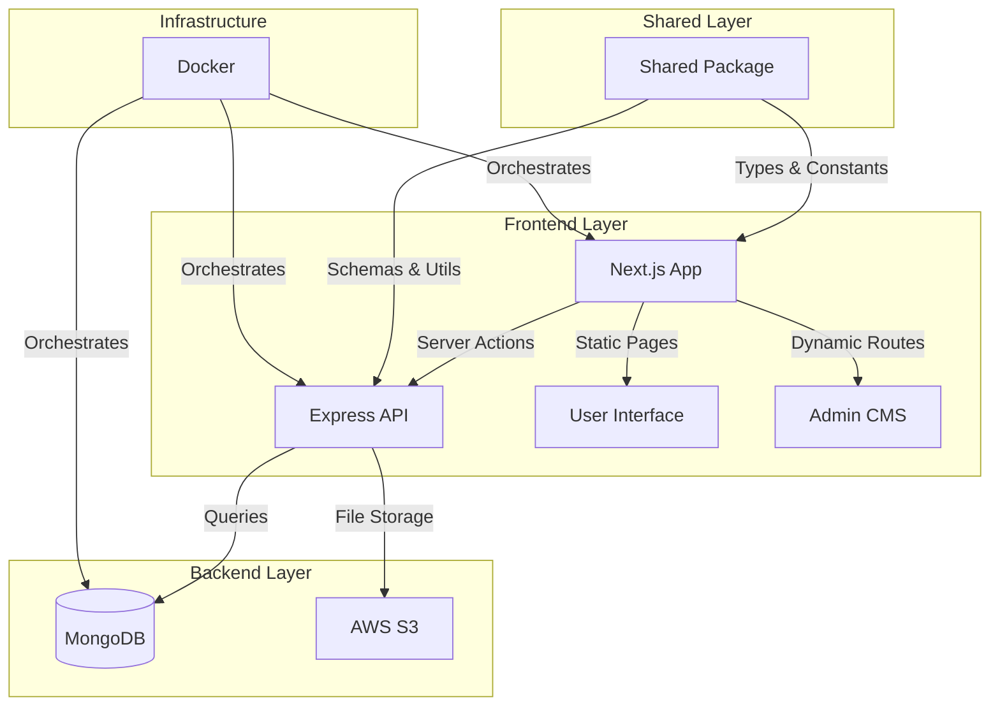

# Full-Stack Portfolio Website

A modern, performant portfolio website built with a microservices architecture using Next.js, Express, and MongoDB. Features a custom CMS, blog platform, and interactive UI components.

## 🏗 Architecture



## 🚀 Key Features

- **Modern Stack**: Next.js 15, React 19, Express.js, MongoDB, TypeScript
- **Monorepo Structure**: Organized with Yarn Workspaces
- **Custom CMS**: Admin dashboard for content management
- **Blog Platform**: Markdown support with rich text editor
- **Internationalization**: Multi-language support (EN/AR)
- **Interactive UI**: Custom animations and interactive components
- **Docker Integration**: Containerized development environment
- **AWS Integration**: S3 for media storage
- **Type Safety**: End-to-end TypeScript implementation

## 🏛 Project Structure

```
portfolio-v3/
├── frontend/           # Next.js application
├── backend/           # Express.js API
├── shared/            # Shared TypeScript package
└── infrastructure/   # Docker and deployment configs
```

### Frontend Features
- Server-Side Rendering (SSR)
- Dynamic routing
- Custom UI components
- Responsive design
- Theme switching
- Interactive animations

### Backend Features
- RESTful API
- MongoDB integration
- AWS S3 integration
- Authentication system
- Rate limiting
- Error handling

### Shared Package
- Type definitions
- Schema validation
- Shared constants
- Utility functions

## 🛠 Tech Stack

- **Frontend**: Next.js, TailwindCSS, TypeScript
- **Backend**: Express.js, MongoDB, TypeScript
- **Infrastructure**: Docker, AWS S3
- **Testing**: [Your testing framework]
- **CI/CD**: [Your CI/CD setup]

## 🚦 Getting Started

1. **Prerequisites**
   - Docker and Docker Compose
   - Node.js 18+
   - Yarn

2. **Installation**
   ```bash
   # Clone the repository
   git clone https://github.com/El-Omar/portfolio-v3.git

   # Install dependencies
   yarn install

   # Start the development environment
   yarn docker:up
   ```

3. **Development**
   ```bash
   # Watch shared package changes
   yarn dev:shared

   # Start frontend development
   yarn dev:frontend

   # Start backend development
   yarn dev:backend
   ```

## 📦 Environment Setup

The project requires several environment variables for proper functionality. Create the following files:

- `frontend/.env.development`
- `backend/.env.development`

[Environment variable templates available in documentation]

## 🎯 Future Improvements

- [ ] Add end-to-end testing
- [ ] Implement CI/CD pipeline
- [ ] Add performance monitoring
- [ ] Add SEO optimization

## 📄 License

MIT © [2025] [El-Omar]

This project is licensed under the MIT License - see the [LICENSE](LICENSE) file for details.
