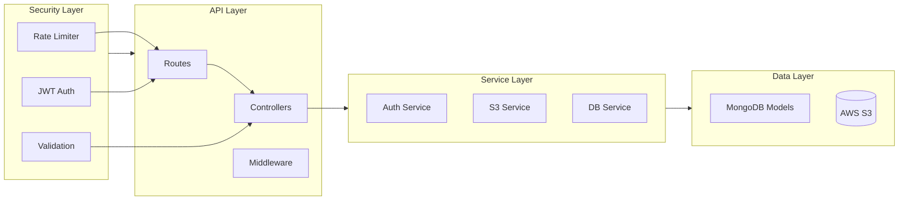

# Portfolio Backend

Express.js backend service providing RESTful APIs for the portfolio website. Features MongoDB integration, AWS S3 storage, and secure authentication.

## 📑 Related Documentation
- [Main Project Documentation](../README.md)
- [Frontend Application](../frontend/README.md)
- [Shared Types & Utils](../shared/README.md)
- [Infrastructure Setup](../infrastructure/README.md)

## 🏗 Architecture



## 📚 Key Features

### API Endpoints
- **Projects API**
  - CRUD operations
  - Image handling
  - Filtering and pagination
  
- **Blog API**
  - Post management
  - Rich text content
  - Media integration

- **Authentication**
  - Secure login system
  - JWT token handling
  - Protected routes

- **Upload System**
  - S3 integration
  - Presigned URLs
  - File validation

### Security Features
- Rate limiting
- Request validation
- Error handling
- CORS configuration
- Secure headers

## 📁 Project Structure

```
backend/
├── src/
│   ├── config/
│   │   ├── aws.ts           # AWS S3 client configuration
│   │   ├── database.ts      # MongoDB connection setup
│   │   ├── env.ts          # Environment variables
│   │   └── environment.ts   # Environment type definitions
│   │
│   ├── controllers/
│   │   ├── auth.controller.ts    # Authentication logic
│   │   ├── blog.controller.ts    # Blog CRUD operations
│   │   ├── project.controller.ts # Project management
│   │   └── upload.controller.ts  # File upload handling
│   │
│   ├── middleware/
│   │   ├── auth.middleware.ts     # JWT authentication
│   │   ├── error.middleware.ts    # Error handling
│   │   ├── logger.middleware.ts   # Request logging
│   │   ├── security.middleware.ts # Rate limiting & security
│   │   └── validate.middleware.ts # Request validation
│   │
│   ├── models/
│   │   ├── blog.model.ts    # Blog post schema & model
│   │   └── project.model.ts # Project schema & model
│   │
│   ├── routes/
│   │   ├── auth.routes.ts    # Authentication routes
│   │   ├── blog.routes.ts    # Blog endpoints
│   │   ├── project.routes.ts # Project endpoints
│   │   └── upload.routes.ts  # Upload endpoints
│   │
│   ├── schemas/
│   │   ├── auth.schema.ts    # Auth validation schemas
│   │   ├── blog.schema.ts    # Blog validation schemas
│   │   ├── project.schema.ts # Project validation schemas
│   │   └── upload.schema.ts  # Upload validation schemas
│   │
│   ├── services/
│   │   └── s3.service.ts    # AWS S3 operations
│   │
│   ├── types/
│   │   └── user.ts         # User-related types
│   │
│   ├── util/
│   │   ├── errors.ts       # Custom error classes
│   │   ├── etag.ts        # ETag generation
│   │   ├── pagination.ts   # Pagination helpers
│   │   ├── projection.ts   # MongoDB projections
│   │   ├── slug.ts        # URL slug generation
│   │   └── time.ts        # Time utilities
│   │
│   └── server.ts          # Express app setup
```

### Key Directories

- **`config/`**: Application configuration and environment setup
- **`controllers/`**: Request handling and business logic
- **`middleware/`**: Express middleware for request processing
- **`models/`**: MongoDB schemas and models
- **`routes/`**: API endpoint definitions
- **`schemas/`**: Request/response validation schemas
- **`services/`**: External service integrations
- **`types/`**: TypeScript type definitions
- **`util/`**: Shared utility functions

## 🔌 API Endpoints

### Projects
```typescript
GET     /api/projects          # List all projects
GET     /api/projects/:slug    # Get project by slug
POST    /api/projects          # Create new project
PATCH     /api/projects/:slug    # Update project
DELETE  /api/projects/:slug    # Delete project
```

### Blog Posts
```typescript
GET     /api/blogs            # List all blog posts
GET     /api/blogs/:slug      # Get blog post by slug
POST    /api/blogs            # Create new blog post
PATCH     /api/blogs/:slug      # Update blog post
DELETE  /api/blogs/:slug      # Delete blog post
```

### Authentication
```typescript
POST    /api/auth/login       # Admin login
GET     /api/auth/verify      # Verify JWT token
```

### File Upload
```typescript
POST    /api/uploads          # Get presigned URL
DELETE  /api/uploads/:key     # Delete file from S3
```

## 🚀 Getting Started

### Prerequisites
- Node.js 18+
- MongoDB
- AWS Account (for S3)
- Yarn

### Environment Setup
Create a `.env.development` file:
```bash
# Server
PORT=5000
API_PREFIX=/api
CMS_ADMIN_PATH=admin

# MongoDB
MONGODB_URI=mongodb://localhost:27017/portfolio
MONGO_INITDB_DATABASE=portfolio

# Authentication
JWT_SECRET=your-secret-key
JWT_EXPIRES_IN=7d

# AWS
AWS_REGION=your-region
AWS_ACCESS_KEY_ID=your-key
AWS_SECRET_ACCESS_KEY=your-secret
AWS_S3_BUCKET=your-bucket
```

### Development
```bash
# Install dependencies
yarn install

# Start development server
yarn dev

# Build for production
yarn build

# Start production server
yarn start
```

## 🔒 Security

### Authentication
- JWT-based authentication
- Secure password hashing with bcrypt
- Protected admin routes

### Rate Limiting
```typescript
// Default limits
- 100 requests per 15 minutes for public APIs
- 20 requests per 15 minutes for authentication
```

### Request Validation
- Zod schema validation
- Input sanitization
- Type checking

### Error Handling
- Standardized error responses
- Error logging
- Development/production error formatting

## 📦 Dependencies

### Core
- `express`: ^4.21.2
- `mongoose`: ^8.9.0
- `typescript`: ^5.7.2

### Security
- `bcrypt`: ^5.1.1
- `jsonwebtoken`: ^9.0.2
- `helmet`: ^8.0.0
- `express-rate-limit`: ^7.5.0

### AWS
- `@aws-sdk/client-s3`: ^3.717.0
- `@aws-sdk/s3-request-presigner`: ^3.717.0

### Validation
- `zod`: ^3.24.1
- `sanitize-html`: ^2.14.0

## 📝 License

MIT © [2025] [El-Omar]
