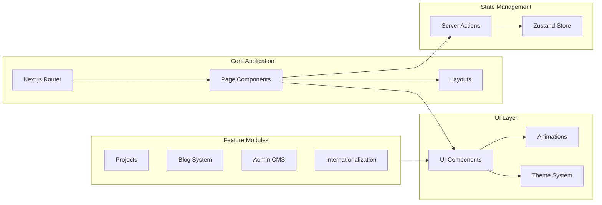

# Portfolio Frontend

Modern, responsive portfolio frontend built with Next.js 15 and React 19. Features server-side rendering, dynamic routing, and interactive UI components.

## 🏗 Architecture



## 📚 Key Features

### Pages & Routing
- Dynamic routes for projects and blog posts
- Internationalized routing (EN/AR)
- Protected admin routes
- Custom 404 and error pages

### Components
- **Layout Components**
  - Responsive navigation
  - Theme switcher
  - Language switcher
  - Interactive cursor
  - Page transitions

- **UI Components**
  - Rich text editor
  - Image upload with preview
  - Form components
  - Loading states
  - Toast notifications

### Animations & Interactions
- Custom cursor effects
- Smooth page transitions
- Parallax scrolling
- Interactive project cards
- Space Invaders mini-game

### Admin Dashboard
- Content management system
- Project creation/editing
- Blog post management
- Media upload system

## 🛠 Tech Stack

- **Framework**: Next.js 15
- **UI Library**: React 19
- **Styling**: TailwindCSS
- **Animations**: Motion One
- **State Management**: Zustand
- **Form Handling**: React Hook Form
- **Validation**: Zod
- **Editor**: TipTap
- **Internationalization**: next-intl

## 📁 Project Structure

```
frontend/
├── src/
│   ├── app/                 # Next.js app router
│   │   ├── [locale]/       # Internationalized routes
│   │   └── admin/          # Admin dashboard
│   ├── components/
│   │   ├── ui/             # Reusable UI components
│   │   ├── layout/         # Layout components
│   │   ├── blog/           # Blog-specific components
│   │   └── projects/       # Project components
│   ├── lib/
│   │   ├── api/           # API client functions
│   │   ├── hooks/         # Custom React hooks
│   │   └── utils/         # Utility functions
│   ├── stores/            # Zustand stores
│   └── types/             # TypeScript definitions
```

## 🚀 Development

### Prerequisites
- Node.js 18+
- Yarn
- Docker (for full-stack development)

### Environment Setup
Create a `.env.development` file:
```env
NEXT_PUBLIC_API_URL=http://localhost:5000/api
NEXT_PUBLIC_CMS_PATH=admin
```

### Starting Development
```bash
# Install dependencies
yarn install

# Start development server
yarn dev
```

### Building for Production
```bash
# Create production build
yarn build

# Start production server
yarn start
```

## 🧪 Testing

[To be implemented]
- Unit tests with Jest
- Component tests with React Testing Library
- E2E tests with Cypress

## 📦 Dependencies

### Core
- `next`: ^15.1.0
- `react`: ^19.0.0
- `@portfolio-v3/shared`: Shared package

### UI & Styling
- `tailwindcss`: ^3.4.1
- `@headlessui/react`: ^2.2.0
- `@radix-ui/react-*`: Various UI primitives

### Forms & Validation
- `@hookform/resolvers`: ^3.9.1
- `zod`: ^3.24.1

### Editor
- `@tiptap/react`: ^2.11.2
- `@tiptap/starter-kit`: ^2.11.2

## 🤝 Contributing

[Your contribution guidelines]

## 📝 License

MIT © [2025] [El-Omar]
