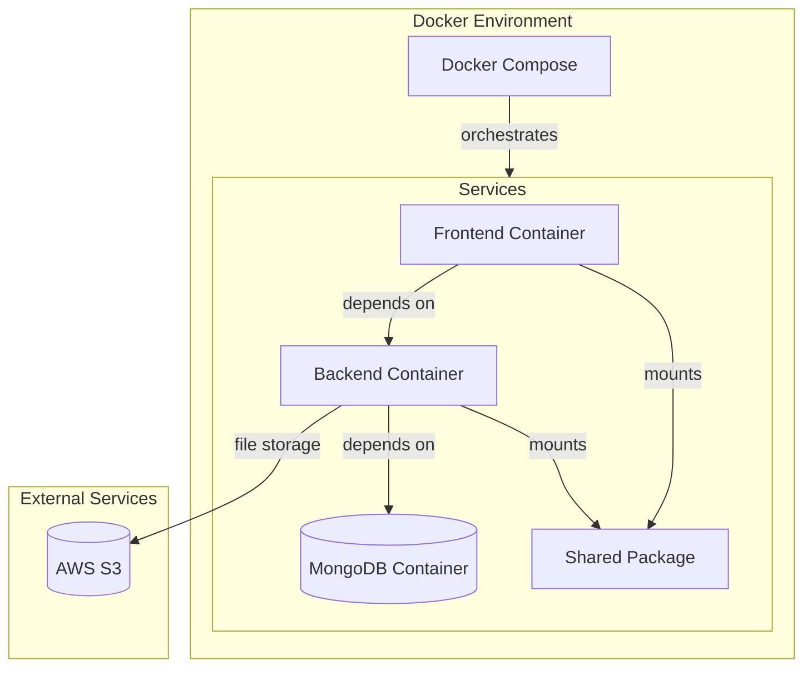

# Infrastructure Configuration

Docker-based infrastructure setup for the portfolio project, managing development and production environments.

## 📑 Related Documentation
- [Main Project Documentation](../README.md)
- [Frontend Configuration](../frontend/README.md)
- [Backend Configuration](../backend/README.md)
- [Shared Package](../shared/README.md)

## 🏗 Architecture



## 📚 Service Configuration

### Frontend Container
- Next.js application
- Port: 3000
- Hot reload enabled
- Shared package mounted
- Environment variables via `.env.development`

### Backend Container
- Express.js API
- Port: 5000
- Nodemon for development
- Shared package mounted
- Environment variables via `.env.development`

### MongoDB Container
- Latest MongoDB
- Port: 27017
- Persistent volume
- Initial database setup
- Health check configured

### Shared Package
- TypeScript library
- Mounted in both frontend and backend
- Watch mode for development

## 📁 Directory Structure

```
infrastructure/
├── docker/
│   ├── frontend.Dockerfile     # Frontend container config
│   ├── backend.Dockerfile      # Backend container config
│   ├── shared.Dockerfile       # Shared package config
│   ├── docker-compose.yml      # Service orchestration
│   └── config/
│       └── mongodb/
│           └── init.js         # MongoDB initialization
```

## 🚀 Usage

### Starting the Environment

```bash
# From project root
yarn docker:up

# Or from infrastructure/docker
docker-compose up -d
```

### Stopping the Environment

```bash
# From project root
yarn docker:down

# Or from infrastructure/docker
docker-compose down
```

### Viewing Logs

```bash
# All services
yarn docker:logs

# Specific service
docker-compose logs -f [service_name]
```

### Rebuilding Services

```bash
# Rebuild all services
yarn docker:rebuild

# Rebuild specific service
docker-compose up -d --build [service_name]
```

## ⚙️ Configuration

### Environment Variables
Create these files in their respective directories:

```bash
# frontend/.env.development
NEXT_PUBLIC_API_URL=http://localhost:5000/api
NEXT_PUBLIC_CMS_PATH=admin

# backend/.env.development
PORT=5000
MONGODB_URI=mongodb://localhost:27017/portfolio
AWS_REGION=your-region
AWS_ACCESS_KEY_ID=your-key
AWS_SECRET_ACCESS_KEY=your-secret
AWS_S3_BUCKET=your-bucket
```

### Volume Mounts
- MongoDB data: `mongodb_data:/data/db`
- Source code:
  - Frontend: `../../frontend:/usr/src/app/frontend`
  - Backend: `../../backend:/usr/src/app/backend`
  - Shared: `../../shared:/usr/src/app/shared`

## 🔧 Development Features

1. **Hot Reload**
   - Frontend changes reflect immediately
   - Backend restarts on code changes
   - Shared package rebuilds automatically

2. **Volume Mounting**
   - Source code mounted for development
   - Node modules managed in containers
   - Database persistence across restarts

3. **Network Configuration**
   - Internal Docker network
   - Exposed ports for local access
   - Service discovery via container names

4. **Health Checks**
   - MongoDB health monitoring
   - Service dependency management
   - Proper startup ordering

## 📝 License

MIT © [2025] [El-Omar]
