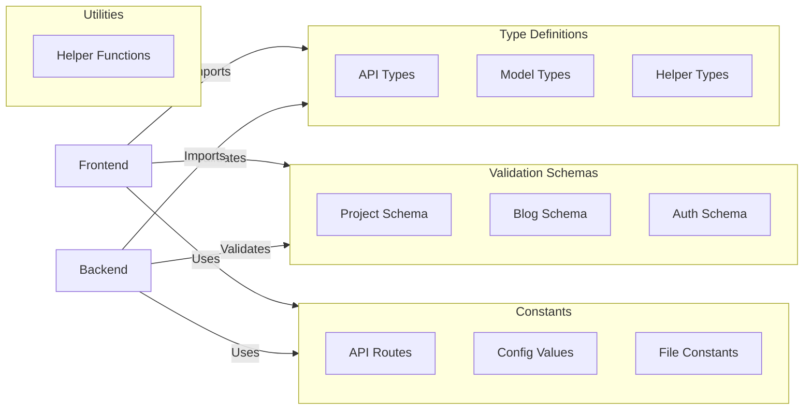

# Shared Package (@portfolio-v3/shared)

Core shared library containing common types, schemas, constants, and utilities used across the portfolio frontend and backend services.

## 🏗 Architecture



## 📚 Key Features

### Type Definitions
- API request/response types
- Database model types
- Shared utility types
- Type-safe API routes

### Validation Schemas
- Project validation
- Blog post validation
- Authentication validation
- File upload validation

### Constants
- API route definitions
- Authentication constants
- File upload constraints
- Shared configuration values

### Utilities
- Type guards
- Helper functions
- Shared transformations

## 📁 Project Structure

```
shared/
├── src/
│   ├── constants/
│   │   ├── api-routes.ts    # API endpoint definitions
│   │   ├── auth.ts         # Authentication constants
│   │   └── files.ts        # File handling constants
│   ├── schemas/
│   │   ├── blog.ts         # Blog validation schemas
│   │   ├── login.ts        # Auth validation schemas
│   │   └── project.ts      # Project validation schemas
│   ├── types/
│   │   ├── api.ts          # API types
│   │   └── helpers.ts      # Utility types
│   └── utils/
│       └── index.ts        # Shared utilities
└── package.json
```

## 🚀 Usage

### Installation
The package is included as a workspace in the monorepo. To use it in other packages:

```json
{
  "dependencies": {
    "@portfolio-v3/shared": "*"
  }
}
```

### Importing

```typescript
// Import types
import type { Project, Blog } from '@portfolio-v3/shared'

// Import schemas
import { projectSchema, blogSchema } from '@portfolio-v3/shared'

// Import constants
import { API_ROUTES, AUTH_CONSTANTS } from '@portfolio-v3/shared'

// Import utilities
import { helpers } from '@portfolio-v3/shared'
```

## 🛠 Development

### Prerequisites
- Node.js 18+
- Yarn

### Building
```bash
# Build the package
yarn build

# Watch for changes
yarn watch
```

### Type Checking
```bash
# Run TypeScript compiler
tsc --noEmit
```

## 📦 Dependencies

### Core
- `typescript`: ^5.0.0
- `zod`: ^3.24.1

## 🔄 Updates

When making changes to this package:

1. Update types/schemas as needed
2. Build the package (`yarn build`)
3. Restart dependent services to pick up changes

## 🤝 Best Practices

1. **Type Safety**
   - Always export proper TypeScript types
   - Use strict type checking
   - Avoid using `any`

2. **Schema Validation**
   - Keep schemas in sync with types
   - Use Zod for runtime validation
   - Document schema constraints

3. **Constants**
   - Use descriptive names
   - Group related constants
   - Document any magic values

4. **Documentation**
   - Document complex types
   - Include usage examples
   - Keep docs up to date

## 📝 License

MIT © [2025] [El-Omar]
